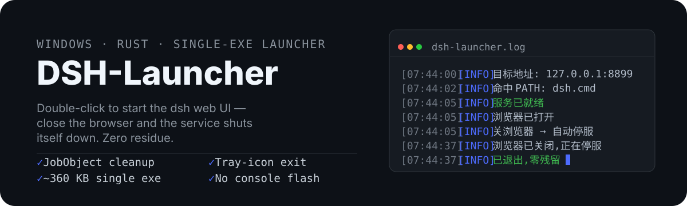
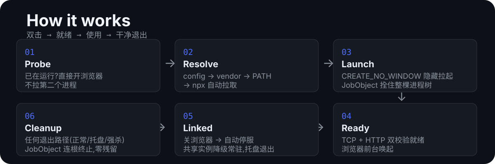

<p align="center">
  
</p>

## What it is / 这是什么

A single-file **Rust** Windows OS launcher for the **dsh** (DeepSeek Harness) web UI — **no WebView2, no runtime deps, just a few hundred KB**. Double-click to start; close the browser and the whole process tree is torn down — no terminal to babysit, no leftover node processes holding the port, no console flash.

一个用 **Rust** 编写的单文件 Windows OS 启动器,用于启动 **dsh**(DeepSeek Harness)Web UI——**免 WebView2、零运行时依赖、体积仅几百 KB**。双击即起，关闭浏览器即自动清理整个进程树——不用守着终端、不会残留 node 进程占端口、全程无黑窗闪烁。

## Quick start / 快速开始

1. Double-click `dsh-launcher.exe` — no config file needed. Defaults: `dsh web` on port 3080.
   双击 `dsh-launcher.exe` —— 无需任何配置,默认以 `dsh web` 启动、端口 3080。
2. Customize via command line (optional) / 需要自定义?命令行参数(可选):
   `dsh-launcher.exe --port 8899 --args "web --port 8899"`
3. Close the browser: dsh shuts down, zero residue. (Browser already open? Right-click the tray icon to exit.)
   关闭浏览器:dsh 自动停服、零残留。(浏览器本就在用?托盘图标右键退出。)

| CLI option / 命令行参数 | Description / 说明 |
| --- | --- |
| `--url <URL>` | Service URL / 服务地址(默认 `http://127.0.0.1:3080`) |
| `--port <N>` | Readiness probe port / 就绪探测端口(默认取 url 端口) |
| `--timeout <secs>` | Readiness timeout / 就绪等待超时(默认 30s) |
| `--package <name>` | npm package for npx / npm 包名(默认 `dsh`) |
| `--args <"a b c">` | dsh launch args, overrides config / dsh 启动参数(覆盖配置文件) |
| `--dsh-path <path>` | Explicit dsh entry / 显式 dsh 入口,跳过解析链 |
| `--check` | Validate the resolution chain only / 仅验证解析链 |
| `-h, --help` | Usage dialog / 用法说明弹窗 |

> `config.json` is **optional** — only override the fields you need. Precedence: command line > config.json > built-in defaults. Copy `config.example.json` to start one if you need a fixed port / permanent args.
> `config.json` 是**可选的** —— 只写需要覆盖的字段。优先级:命令行 > config.json > 内置默认。需要固定端口/固定参数时,复制 `config.example.json` 起步。

```json
{
  "dsh_path": "",
  "url": "http://127.0.0.1:8899",
  "port": 8899,
  "timeout_secs": 40,
  "package": "dsh",
  "args": ["web", "--port", "8899"]
}
```

| Field / 字段 | Description / 说明 | Default / 默认 |
| --- | --- | --- |
| `dsh_path` | Explicit dsh entry; skips the rest of the chain when set / 显式 dsh 入口路径,设置后跳过其余解析链 | empty / 空(自动解析) |
| `url` | URL opened in the browser once ready / 服务就绪后浏览器打开的地址 | `http://127.0.0.1:3080` |
| `port` | Readiness probe port (falls back to url port) / 就绪探测端口(不设则从 url 解析) | url port |
| `timeout_secs` | Max wait; auto-extended to 60s for first npx pull / 最大等待超时;npx 首次拉取自动放宽到 60s | 30 |
| `package` | npm package name (used by npx) / npm 包名(npx 拉取用) | `dsh` |
| `args` | Extra args passed to dsh / 透传给 dsh 的启动参数 | `[]` |

> `dsh` is DeepSeek Harness; the web UI entry is `dsh web` (a.k.a. `dsh --profile web`). Pass port etc. via `args`.
> dsh 是 DeepSeek Harness,Web 界面入口为 `dsh web`(等价 `dsh --profile web`),端口等参数按需透传。

```powershell
# Only validate the resolution chain, don't actually start / 仅验证 dsh 命令解析链,不实际启动
.\dsh-launcher.exe --check
```

## How it works / 工作原理

<p align="center">
  
</p>

1. **Probe / 探测**: service already running? Open the browser and exit — never a second instance.
   端口已就绪?直接开浏览器退出,绝不拉第二个进程。
2. **Resolve / 解析**: config path → `vendor\dsh\` offline bundle → `dsh` on PATH → `npx --yes dsh`, validated with `dsh --version`.
   解析链:配置路径 → `vendor\dsh\` 离线包 → PATH 中的 dsh → `npx --yes dsh` 自动拉取,`dsh --version` 校验可用性。
3. **Launch / 拉起**: `cmd.exe /C` hidden with `CREATE_NO_WINDOW`, immediately bound to a JobObject.
   `CREATE_NO_WINDOW` 隐藏窗口拉起,立即绑定 JobObject。
4. **Ready / 就绪**: TCP connect + HTTP GET double check (port open ≠ ready), then `ShellExecuteExW` opens the browser foreground-activated.
   TCP 连通 + HTTP 响应双重校验(端口通 ≠ 服务就绪),就绪后用 `ShellExecuteExW` 前台唤起浏览器。
5. **Linked / 联动**: freshly launched browser closes → dsh auto-shuts-down; browser already running → resident mode, exit via tray icon.
   关闭拉起的浏览器 → 自动关服;浏览器本就开着 → 降级常驻,托盘图标退出。
6. **Cleanup / 清理**: every exit path (normal / tray / force-killed) — JobObject kills the whole process tree, zero residue.
   任何退出方式(正常 / 托盘 / 被强杀),JobObject 连根终止进程树,零残留。

## Features / 特性

- **Auto-discovery / 自动发现**: config path → offline `vendor\dsh\` → PATH → `npx`, no global install required
  解析链自动发现 dsh:配置路径 → 离线 `vendor\dsh\` → PATH → npx,免全局安装
- **Real readiness probe / 真实就绪探测**: TCP + HTTP double check with adaptive backoff and timeout guard
  TCP 连通 + HTTP 响应双重校验,自适应退避 + 超时保护
- **Zero residue / 零残留**: JobObject `KILL_ON_JOB_CLOSE` — normal, tray, or task-manager exit all terminate the full tree
  JobObject `KILL_ON_JOB_CLOSE`:正常 / 托盘 / 任务管理器强杀,进程树全部自动终止
- **Browser-linked lifecycle / 浏览器联动**: close the launched browser → auto shutdown; shared instance → resident mode (tray exit), never kills your windows
  关闭拉起的浏览器 → 自动停服;共享实例降级常驻(托盘退出),不误杀正在用的窗口
- **Opens your default browser / 调用系统默认浏览器**: `ShellExecuteExW` respects the OS default browser (Chrome / Edge / Firefox / whatever you use) — no bundled browser, no hardcoded engine; browser-link lifecycle tracks common browsers
  用系统默认浏览器打开 dsh web(Chrome / Edge / Firefox / 你惯用的任何浏览器),不捆绑浏览器、不强绑内核;浏览器联动自动识别常见浏览器进程
- **Silent UX / 无窗体验**: GUI subsystem, no console window, no black-window flicker; log to `dsh-launcher.log`, errors pop a dialog
  GUI 子系统无控制台、无黑窗闪烁;日志落盘 `dsh-launcher.log`,出错弹窗提示
- **Failure guards / 异常守护**: dsh dies during probing → report immediately (exit 4); timeout → cleanup (exit 3)
  探测期 dsh 提前退出立即报错(退出码 4);超时自动清理(退出码 3)
- **Single file / 单文件**: ~360 KB exe, app icon embedded, zero runtime dependencies
  约 360KB 单文件,内嵌图标,零运行时依赖
- **No WebView2 / 不依赖 WebView2**: plain Win32 tray + dialogs — no Edge/WebView2 Runtime needed, no 100+ MB webview payload, works on any Windows 7+
  原生 Win32 托盘与弹窗,不使用 Windows 内置的 WebView2:无需 Edge/WebView2 运行时,不携带上百 MB 的 WebView 体积,Windows 7+ 开箱即用

### Exit codes / 退出码

| Code / 码 | Meaning / 含义 |
| --- | --- |
| 0 | Normal exit / 正常退出 |
| 1 | Config error / dsh spawn failed / 配置错误 / dsh 启动失败 |
| 2 | Port open but HTTP abnormal / 端口已就绪但服务响应异常 |
| 3 | Wait timeout / 等待服务超时 |
| 4 | dsh exited early / unexpectedly / dsh 进程提前/异常退出 |
| 5 | dsh resolution / auto-install failed (incl. no npm) / dsh 命令解析/自动安装失败(含 npm 不存在) |

## Install via dsh plugin / 通过 dsh 插件安装

DSH-Launcher also ships as a `dsh` plugin (Windows only): `dsh plugin add` succeeds **on the first try, zero friction** — the exe rides inside the package (repo `dist/dsh-launcher.exe`, no lifecycle scripts, never triggers pnpm ≥10's build-script gate).
DSH-Launcher 同时提供 `dsh` 插件分发渠道(仅 Windows):`dsh plugin add` **一次成功、零拦截**——
exe 随包自带(仓库 `dist/dsh-launcher.exe`,无任何生命周期脚本,不触发 pnpm ≥10 的构建脚本门禁)。

```sh
# Install (one-shot; the exe lands in node_modules with the package) / 安装(一次成功,exe 随包进入 node_modules)
dsh plugin --profile web add github:alvinpro/dsh-launcher
```

After install the exe is already in place (`node_modules\dsh-launcher\dist\dsh-launcher.exe`). The desktop shortcut — pointing **straight at the bundled exe (zero copies, zero residue)** — can be created two ways. **It is created exactly once, on the first run**; later dsh web starts never recreate it, even if you delete the shortcut yourself (to restore: re-run `dsh plugin add`, or delete the marker file `node_modules\dsh-launcher\.shortcut-created` and restart dsh):
安装后 exe 已随包就位(`node_modules\dsh-launcher\dist\dsh-launcher.exe`)。创建桌面快捷方式
(直接指向该 exe,**零复制、零残留**)有两种方式。**快捷方式仅在首次运行时创建一次**,
之后每次启动 dsh web 都不会再生成——即使你把桌面快捷方式删掉了也不会重建
(想恢复:重新 `dsh plugin add` 或删除标记文件 `node_modules\dsh-launcher\.shortcut-created` 后重启 dsh):

```powershell
# Option 1 (immediate): one-click script — add + init in one step, shortcut appears right away / 方式 1(立即):运行一键脚本,add + 初始化一步完成,桌面快捷方式立刻出现
powershell -ExecutionPolicy Bypass -File scripts\install-plugin.ps1

# Option 2 (automatic): just start dsh web — the plugin's apply() creates the shortcut on its first run / 方式 2(自动):直接启动 dsh web,插件的 apply() 首次启动时自动创建快捷方式
dsh --profile web
```

```sh
# Dev / debug: install straight from this repo / 开发调试:本仓库目录直接安装
dsh plugin --profile web add .

# Uninstall (remove the plugin, then delete the desktop shortcut — nothing else to clean up) / 卸载(移除插件后,删除桌面快捷方式即可,无其他残留)
dsh plugin --profile web remove dsh-launcher
Remove-Item "$([Environment]::GetFolderPath('Desktop'))\DSH Launcher.lnk" -Force
```

How it works: the repo root is a pure-JS `dsh` bundle (declares `dsh.bundle.patch`) with **no lifecycle scripts**, so pnpm ≥10 never blocks it and `add` succeeds once; the exe ships inside the package `dist/` (it comes along with the git clone at add time, zero download). The desktop shortcut is created by `install.js` and **points straight at the in-package exe** (nothing copied to AppData; `dsh plugin remove` deletes the exe with the package, no residue); after the first creation a `.shortcut-created` marker is written and later starts skip it.
原理:仓库根是一个纯 JS 的 `dsh` bundle(声明 `dsh.bundle.patch`),**无 lifecycle 脚本**,所以
pnpm ≥10 不会拦截,`add` 一次成功;exe 打进包内 `dist/`(add 时随 git clone 自带,零下载)。
桌面快捷方式由 `install.js` 创建并**直接指向包内 exe**(不复制到 AppData,`dsh plugin remove`
后 exe 随包删除,无残留),首次创建后写入 `.shortcut-created` 标记,后续启动直接跳过。

## Offline distribution / 内网离线分发

No network? Skip npx: copy the dsh package into `vendor\dsh\` next to the exe (supports `dsh.exe` / `dsh.cmd` / `bin\dsh.exe` / `bin\dsh.cmd` / `main.js`) — the resolution chain hits it automatically.
无网环境无法走 npx:把 dsh 包拷入 exe 同目录 `vendor\dsh\`(支持 `dsh.exe` / `dsh.cmd` / `bin\dsh.exe` / `bin\dsh.cmd` / `main.js`),解析链自动命中。

## Build / 构建

```powershell
cargo build --release
# Output / 产物: target\release\dsh-launcher.exe
```

Prerequisite / 前置要求: Rust stable (edition 2024) / Rust 稳定版工具链(edition 2024)。

```powershell
cargo test --release
```

Verified / 实测通过: full startup (browser auto-opens, no console window, no black-window flicker — audited twice), tray-icon exit, browser-close auto-shutdown, handoff degradation (shared browser → resident), force-kill cleanup (processes zeroed, port released), early-exit detection, timeout cleanup, shim resolution.
实测通过:完整启动(浏览器自动打开、无黑窗闪烁——二次稽核)、托盘退出、关闭浏览器自动停服、握手降级(共享实例 → 常驻)、强杀清理(进程归零、端口释放)、提前退出检测、超时清理、shim 解析。


## Design decisions / 设计决策

- **Why not Tauri 2.0 / 为什么不用 Tauri 2.0**: the launcher has no UI needs — WebView adds 3~5MB, a WebView2 runtime dependency and the Node toolchain for zero benefit. Native tray + dialogs are plain Win32; if a real UI is ever needed, follow the migration path in the design doc and reuse the process-management code as-is.
  启动器无 UI 需求,WebView 只会徒增体积与依赖;托盘、弹窗用原生 Win32 即可。真需要界面时按设计文档的升级路线迁移,进程管理代码原样复用。
- **`where` vs `where.exe`**: in PowerShell `where` is an alias for `Where-Object` — always use `where.exe dsh`.
  PowerShell 里 `where` 是 `Where-Object` 别名,检测命令必须用 `where.exe dsh`。
- **npm shim trio / npm shim 三件套**: `dsh` (extensionless), `dsh.cmd` (executable), `dsh.ps1` (PowerShell only) — the launcher only accepts `.cmd`/`.exe`.
  `dsh`(无扩展名)、`dsh.cmd`(可执行)、`dsh.ps1`(仅 PowerShell)——启动器只认 `.cmd`/`.exe`。


## License / 许可证

MIT — see [LICENSE](LICENSE) / MIT 许可证——详见 [LICENSE](LICENSE)
